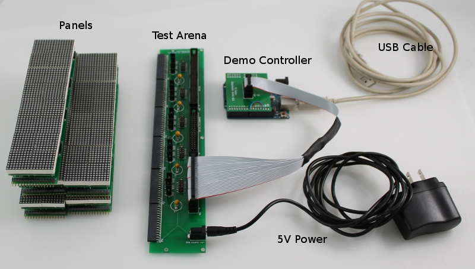
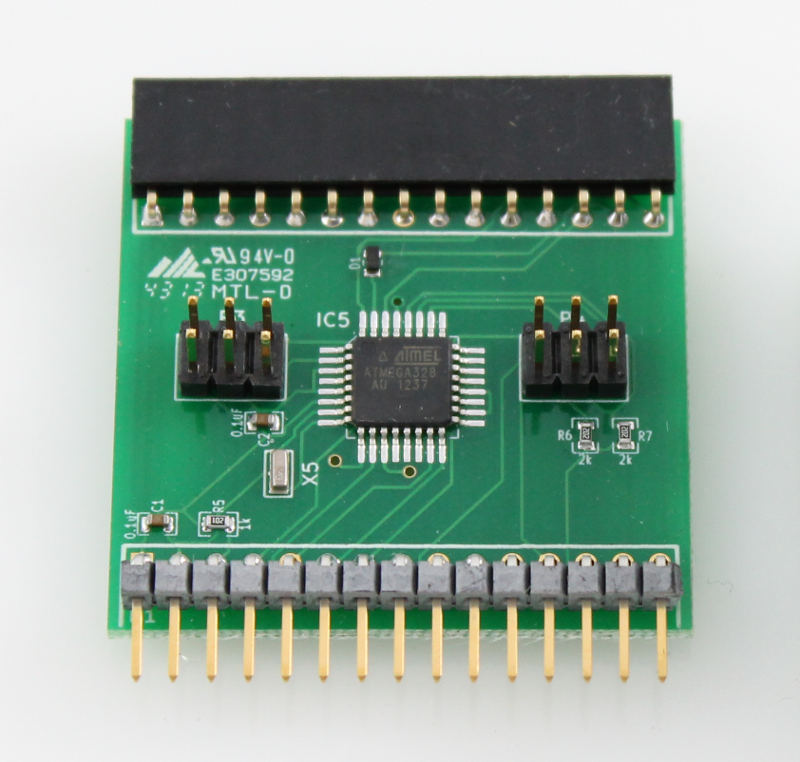

System Components
=====================================

The prototype G4 system consists of four components:

* Display panels - 20 display panels, each panel has a four 8x8 20mm LED matrices.
* Test Arena - configurable planar arena which can accommodate 6 columns of panels.  
* Demo Controller - simple Arduino Uno based controller which shows a moving stripe pattern.
* 5V power supply (2.1mm center positive).

The `mercurial <http://mercurial.selenic.com>`_ repository of design files for
G4 panels hardware can be found `here
<https://bitbucket.org/iorodeo/panels_g4_hardware/src>`_. Note, the design files
for the PCBs use the `kicad
<http://www.kicad-pcb.org/display/KICAD/KiCad+EDA+Software+Suite>`_ EDA
software suite.

The source code for the firmware used by the display panels and the demo controller 
can be found `here <https://bitbucket.org/iorodeo/panels_g4_firmware/src>`_.

Display Panels
------------------------------------
A display panel consists of two sub-panel PCBs - the comm (communications) sub-panel and  the driver (display) sub-panel. 

.. figure:: _static/display_panels.png
   :align:  center

Driver Sub-Panels
~~~~~~~~~~~~~~~~~~~~~~~~~~~~~~~~~~~~
The driver sub-panel has four atmega328 micro-controllers - one for each 8x8
display matrix. Each micro-controller on the driver sub-panel is responsible
for receiving pattern data from the comm sub-panel over I2C and displaying this
data on its associated LED matrix. The four LED matrices which attach
to the driver are ordered from  0 to 3 as shown in the image below. 

.. figure:: _static/atmega_driver_front.png
   :align:  center

:download:`Driver PCB Schematic <_static/driver.pdf>`.

Comm Sub-Panels
~~~~~~~~~~~~~~~~~~~~~~~~~~~~~~~~~~~~
The comm sub-panel has a single atmega328 micro-controller which communicates
with the system controller over SPI. The comm sub-panel is responsible for
receiving pattern data from the controller (over SPI), it then splits the
pattern data into four pieces (one for each LED matrix) ands sends this data on
to the four atmega328 micro-controllers on it associated driver sub-panels over
I2C. 

:download:`Comm PCB Schematic  <_static/comm.pdf>`.

Test Arena 
------------------------------------ 
The test arena is used to connect the panels with the controller and to supply
power to the panels. There are three headers which can be used to connected the panels to the
display controller.  

* P22 40-Pin (2x20) single SPI bus header. 
* P23 60_Pin (2x30) six SPI bus header.
* P30 40-Pin (2x20) six SPI bus w/ common chip select lines.

.. figure:: _static/test_arena.png
   :align:  center

5V power is supplied to the panels via 2.1mm DC jack, polarity is center positive. 

There are 5 sets of jumpers which can be used to configure the
arena.  (To do document jumper functions - for now refer to the arena schematic.)

:download:`Arena PCB Schematic  <_static/arena.pdf>`.

Demo Controller
------------------------------------

A demonstration controller, based on an Arduino Uno, is provided with the arena
and panels.  The demonstration controller connects to header P22 on the arena and will
display a moving stripe pattern in 16-level gray scale mode.  The panels (up to
four) should be connected to header P1 when using the demo controller. 
Note, the demo controller requires 5V power via the USB connector on the
Arduino Uno in order to operate.

.. figure:: _static/demo_controller.png
   :align:  center

A video of the demo controller connected to the test arena and displaying the moving stripe
pattern is shown below. 

.. raw:: html

        

        <object width="480" height="385"><param name="movie"
        value="http://www.youtube.com/v/SBqYZ3KdAUc&hl=en_US&fs=1&rel=0"></param><param
        name="allowFullScreen" value="true"></param><param
        name="allowscriptaccess" value="always"></param><embed
        src="http://www.youtube.com/v/vgf_y8ZDPE4?version=3&loop=1&playlist=vgf_y8ZDPE4"
        type="application/x-shockwave-flash" allowscriptaccess="always"
        allowfullscreen="true" width="480"
        height="385"></embed></object>
        

5V Power Supply
------------------------------------

A 5V 1A power supply is provided with the prototype panels, arena and
controller. This supply is sufficient for operating roughly four panels - so
enough for running the demo controller.  A higher current supply will likely be
required in order to operate more than four panels. When selecting a power
supply roughly 0.25A should be budgeted for each panel.  The connector is a
2.1mm DC jack and the supply should be center positive.

 

